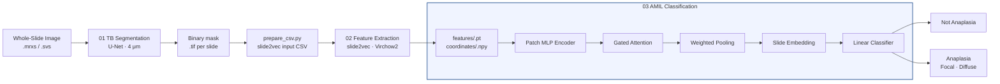
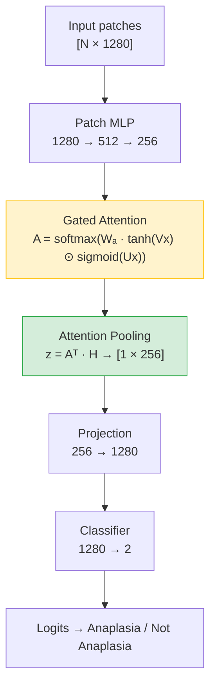

# Wilms Tumor Anaplasia Classification — End-to-End Pipeline

> Full pipeline for automated anaplasia detection in pediatric Wilms Tumor histopathology: tissue segmentation → feature extraction → Attention-Based Multiple Instance Learning (AMIL).

---

## Overview

Wilms Tumor (nephroblastoma) is the most common pediatric kidney cancer. Accurate detection of **anaplasia** — a histological marker of aggressive disease — is critical for treatment stratification but remains challenging due to its focal distribution across large whole-slide images (WSIs).

This repository implements the complete classification pipeline:

```
WSI (.mrxs / .svs / .tif)
 │
 ├─► 01 Tissue/Background Segmentation
 │       U-Net · MobileNetV2 · spacing 4 μm
 │       → binary multiresolution TIFF mask per slide
 │
 ├─► 02 Feature Extraction  (slide2vec)
 │       Foundation model encodes each 224×224 patch → [N_patches × feat_dim]
 │       → <slide_id>.pt  (features)  +  <slide_id>.npy  (coordinates)
 │
 └─► 03 AMIL Classification
         ┌─────────────────────────────┐
         │  patches → MLP → Gated      │
         │  Attention → pooling →      │
         │  slide embedding → logit    │
         └─────────────────────────────┘
              ↓               ↓
         Anaplasia       Not Anaplasia
```

---

## Pipeline Architecture



---

## Model: AttentionSingleBranch



---

## Repository Structure

```
wilms-anaplasia-mil/
│
├── Dockerfile                        # Reference build (pull pierpaolov93/pathology-pipeline:cellvit)
│
├── configs/
│   ├── slide2vec.yaml                # slide2vec feature extraction config
│   ├── runs.yaml                     # AMIL experiment registry
│   └── linear_runs.yaml              # Linear/MLP baseline registry
│
├── pipeline/
│   ├── 01_segmentation/
│   │   ├── run_segmentation.py       # TB segmentation over a WSI directory
│   │   └── download_models.py        # Download model weights from HuggingFace
│   │
│   ├── 02_feature_extraction/
│   │   └── prepare_csv.py            # Generate slide2vec input CSV from WSI + mask dirs
│   │
│   └── 03_classification/
│       ├── mil_modules.py            # Core: AMIL model, dataset, training, visualization
│       ├── mil_main.py               # Training CLI
│       ├── mil_inference.py          # Inference + heatmap generation CLI
│       ├── preprocessing.py          # Patient-level fold generation & leakage check
│       └── linear_probing.py         # Linear / MLP baseline classifiers
│
├── scripts/
│   └── run_pipeline.slurm            # End-to-end SLURM job script
│
└── external_inference.ipynb          # Ensemble inference on external cohorts
```

---

## Environment

All code runs inside the **pathology-pipeline Docker container**:

```bash
docker pull pierpaolov93/pathology-pipeline:cellvit
```

The image bundles PyTorch 2.4.1, OpenSlide, ASAP, slide2vec, and all WSI dependencies. The `Dockerfile` in this repo is a reference for building from source — see [pathology-segmentation-pipeline](https://github.com/PierpaoloV/pathology-segmentation-pipeline).

---

## Usage

### 1. Tissue/Background Segmentation

```bash
python pipeline/01_segmentation/run_segmentation.py \
    --wsi_dir  /data/slides/ \
    --output_dir /data/masks/tb/
```

Downloads the TB model on first run. Skips slides whose mask already exists.

### 2. Prepare slide2vec CSV

```bash
python pipeline/02_feature_extraction/prepare_csv.py \
    --wsi_dir   /data/slides/ \
    --mask_dir  /data/masks/tb/ \
    --output_csv /data/slide2vec_input.csv
```

### 3. Feature Extraction (slide2vec)

Edit `configs/slide2vec.yaml` (paths, model, spacing), then:

```bash
python -m slide2vec --config configs/slide2vec.yaml
```

See [slide2vec docs](https://github.com/clemsgrs/slide2vec) for full config reference.

### 4. Generate patient-level folds

```bash
python pipeline/03_classification/preprocessing.py \
    --csv /path/to/labels.csv \
    --output /path/to/splits.csv

# Verify no patient leakage
python pipeline/03_classification/preprocessing.py --check /path/to/splits.csv
```

### 5. AMIL Training

```bash
# Single run
python pipeline/03_classification/mil_main.py \
    --config configs/runs.yaml \
    --run baseline_weighted

# All runs (skip completed)
python pipeline/03_classification/mil_main.py \
    --config configs/runs.yaml \
    --run all

# Force rerun
python pipeline/03_classification/mil_main.py \
    --config configs/runs.yaml \
    --run baseline_weighted --rerun
```

Each completed run saves three checkpoints per fold, selected retrospectively after all epochs finish (epochs 1–3 excluded as warmup):

| File | Selected by |
|------|-------------|
| `models/mil_best_auc_fold{N}.pt` | highest validation AUC |
| `models/mil_best_loss_fold{N}.pt` | lowest validation loss |
| `models/mil_best_gmean_fold{N}.pt` | highest Gmean = √(sensitivity × specificity) |

When two or more criteria point to the same epoch this is logged and the checkpoint is copied under each name. Inference uses `mil_best_auc_fold{N}.pt` as the default.

### 6. Inference & Attention Heatmaps

```bash
# Heatmap + top-k region grid (one PNG per slide)
python pipeline/03_classification/mil_inference.py \
    --config configs/runs.yaml \
    --run all --rerun --device cuda \
    --extract_region --combine_subplots

# Heatmap only (paper figures)
python pipeline/03_classification/mil_inference.py \
    --config configs/runs.yaml \
    --run all --device cuda
```

Use `--checkpoint` to select which saved model to load per fold (default: `auc`):

```bash
# Use best Gmean checkpoint instead of best AUC
python pipeline/03_classification/mil_inference.py \
    --config configs/runs.yaml \
    --run baseline --device cuda --checkpoint gmean
```

| `--checkpoint` | Loads |
|---|---|
| `auc` (default) | `mil_best_auc_fold{N}.pt` |
| `loss` | `mil_best_loss_fold{N}.pt` |
| `gmean` | `mil_best_gmean_fold{N}.pt` |

### 7. Linear / MLP Baselines

```bash
python pipeline/03_classification/linear_probing.py \
    --config configs/linear_runs.yaml \
    --run mlp_yes_256hdim_0penalty

# All baseline runs
python pipeline/03_classification/linear_probing.py \
    --config configs/linear_runs.yaml \
    --run all
```

### 8. External Cohort Inference

Use `external_inference.ipynb` to run ensemble inference on an external dataset. Set the paths in the `PLACEHOLDERS` cell at the top, then run all cells. Outputs per slide:
- `.npz` attention files (per fold + ensemble)
- PNG reports — combined (heatmap + ranked patch grid) or heatmap-only

### 9. Full pipeline via SLURM

Edit the `PATHS` section in `scripts/run_pipeline.slurm`, then:

```bash
sbatch scripts/run_pipeline.slurm
```

---

## Experiments

### AMIL runs (`configs/runs.yaml`)

| Run | Architecture | Dataset | Weighted sampling | Penalty |
|-----|-------------|---------|:-----------------:|:-------:|
| `baseline` | `[1280→512→256]` | All slides | ✗ | 0 |
| `baseline_weighted` | `[1280→512→256]` | All slides | ✓ | 0 |
| `deep_attention` | `[1280→2048→1024→512→256]` | All slides | ✓ | 0 |
| `only_yes` | `[1280→512→256]` | Selected slides | ✓ | 0 |
| `deep_yes` | `[1280→2048→1024→512→256]` | Selected slides | ✓ | 0 |
| `yes_penalty` | `[1280→512→256]` | Selected slides | ✓ | 2.0 |

### Baseline runs (`configs/linear_runs.yaml`)

Linear probing and MLP classifiers on frozen features — 18 runs covering:
- Model: `linear` · `mlp` (64-dim / 256-dim hidden)
- Data: all slides · quality-filtered slides
- Penalty factor: 0 · 5 · 10

---

## Visualization

Attention reports are generated by `wsi_attention_heatmap` in `mil_modules.py`. Each PNG shows:

- **Left**: WSI thumbnail with plasma colormap overlay. Alpha is proportional to attention score — low-attention regions show raw tissue, high-attention regions receive full color.
- **Right** (`combine_subplots=True`): Top-k patches or context regions ranked by attention, with plasma-scale colored borders (bright = rank #1) and rank + score annotations.

Key parameters (set in `configs/runs.yaml`):

| Parameter | Default | Description |
|-----------|---------|-------------|
| `cmap_name` | `"plasma"` | Colormap for heatmap and patch borders |
| `alpha` | `0.6` | Max overlay opacity (reached at peak attention) |
| `draw_topk` | `20` | Number of top patches/regions highlighted |
| `extract_region` | `false` | `true` = 6 context regions (1024×1024); `false` = 20 patches |
| `combine_subplots` | CLI flag | Pass `--combine_subplots` for combined PNG |
| `report_workers` | auto | Workers for parallel report generation (defaults to `SLURM_CPUS_PER_TASK`) |

---

## Label Schema

| `Diagnose` value | Binary label | 3-class label |
|-----------------|:------------:|:-------------:|
| `Not Anaplasia` | 0 | 0 |
| `Focal` | 1 | 1 |
| `Diffuse` | 1 | 2 |

Binarization collapses Focal and Diffuse into a single **Anaplasia** class (label = 1).

---

## License

This project is licensed under the [Apache License 2.0](LICENSE).
