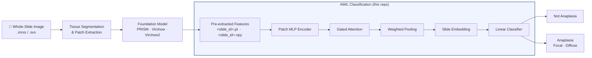
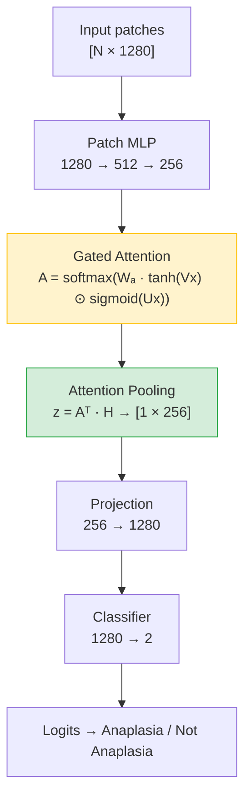

# Wilms Tumor Anaplasia Classification via Attention-Based MIL

> Binary classification of anaplasia in pediatric Wilms Tumor histopathology using Attention-Based Multiple Instance Learning (AMIL) on pre-extracted foundation model features.

---

## Overview

Wilms Tumor (nephroblastoma) is the most common pediatric kidney cancer. Accurate detection of **anaplasia** — a histological marker of aggressive disease — is critical for treatment stratification but remains challenging due to focal distribution across large whole-slide images (WSIs).

This project implements a complete pipeline for automated anaplasia classification:

```
WSI
 │
 ├─► Tissue segmentation & tiling
 │       (external: slide2vec + PRISM/Virchow/Virchow2)
 │
 ├─► Feature extraction per patch
 │       Foundation model encodes each 224×224 patch → [N_patches × 1280]
 │
 └─► Classification
         ┌─────────────────────────────┐
         │   Attention-Based MIL       │
         │   (AMIL — this repo)        │
         │                             │
         │  patches → MLP → Gated      │
         │  Attention → pooling →      │
         │  slide embedding → logit    │
         └─────────────────────────────┘
              ↓               ↓
         Anaplasia       Not Anaplasia
```

---

## Pipeline Architecture



---

## Model: AttentionSingleBranch



---

## Repository Structure

```
wilms-anaplasia-mil/
│
├── virchow_code/
│   ├── mil_modules.py        # Core: AMIL model, dataset, training, visualization
│   ├── mil_main.py           # Training CLI  →  python mil_main.py --config runs.yaml --run <name>
│   ├── mil_inference.py      # Inference CLI →  python mil_inference.py --config runs.yaml
│   ├── linear_probing.py     # Linear / MLP baseline classifiers
│   ├── preprocessing.py      # Patient-level fold generation & leakage check
│   ├── runs.yaml             # AMIL experiment registry
│   └── linear_runs.yaml      # Linear/MLP experiment registry
│
├── Anaplasia_Classification/
│   └── yaml/                 # Feature extraction configs (PRISM, Virchow, Virchow2)
│
├── Anaplasia_Notebook.ipynb  # Exploratory analysis & t-SNE visualizations
└── README.md
```

---

## Experiments

### AMIL runs (`runs.yaml`)

| Run | Architecture | Dataset | Weighted sampling | Penalty |
|-----|-------------|---------|:-----------------:|:-------:|
| `baseline` | `[1280→512→256]` | All slides | ✗ | 0 |
| `baseline_weighted` | `[1280→512→256]` | All slides | ✓ | 0 |
| `deep_attention` | `[1280→2048→1024→512→256]` | All slides | ✓ | 0 |
| `only_yes` | `[1280→512→256]` | Selected slides | ✓ | 0 |
| `deep_yes` | `[1280→2048→1024→512→256]` | Selected slides | ✓ | 0 |
| `yes_penalty` | `[1280→512→256]` | Selected slides | ✓ | 2.0 |

### Baseline runs (`linear_runs.yaml`)

Linear probing and MLP classifiers on frozen features — 18 runs covering:
- Model: `linear` · `mlp` (64-dim / 256-dim hidden)
- Data: all slides · quality-filtered slides
- Penalty factor: 0 · 5 · 10

---

## Usage

### 1. Preprocessing — generate patient-level folds

```bash
python virchow_code/preprocessing.py \
    --csv /path/to/wilmstumor.csv \
    --output /path/to/splits.csv

# Verify no patient leakage
python virchow_code/preprocessing.py --check /path/to/splits.csv
```

### 2. AMIL Training

```bash
# Single run
python virchow_code/mil_main.py \
    --config virchow_code/runs.yaml \
    --run baseline_weighted

# All runs (skip completed)
python virchow_code/mil_main.py \
    --config virchow_code/runs.yaml \
    --run all

# Force rerun
python virchow_code/mil_main.py \
    --config virchow_code/runs.yaml \
    --run baseline_weighted --rerun
```

### 3. Inference & Attention Maps

```bash
python virchow_code/mil_inference.py \
    --config virchow_code/runs.yaml \
    --device cuda \
    --combine_subplots
```

### 4. Linear / MLP Baselines

```bash
python virchow_code/linear_probing.py \
    --config virchow_code/linear_runs.yaml \
    --run mlp_yes_256hdim_0penalty

# All baseline runs
python virchow_code/linear_probing.py \
    --config virchow_code/linear_runs.yaml \
    --run all
```

---

## Configuration

Both `runs.yaml` and `linear_runs.yaml` share a `defaults` block merged with per-run overrides at runtime. Key fields for `runs.yaml`:

```yaml
defaults:
  base_dir: "/path/to/virchow_features/"    # pre-extracted .pt + .npy files
  labels_csv: "/path/to/splits_updated.csv"
  wsi_dir: "/path/to/WSI/"
  output_base_dir: "/path/to/experiments/"
  patch_size: 224
  n_classes: 2
  epochs: 20
  lr: 1e-4
  size: [1280, 512, 256]   # MLP layer dims
  weighted: false
  device: "cuda"
```

---

## Environment

All code is designed to run inside the **pathology-pipeline Docker container**, which provides `openslide`, `torch`, `timm`, and WSI-processing dependencies.

### Python dependencies

```
torch
numpy
pandas
scikit-learn
matplotlib
seaborn
tqdm
openslide-python
opencv-python
scipy
Pillow
pyyaml
```

---

## Label Schema

| `Diagnose` value | Binary label | 3-class label |
|-----------------|:------------:|:-------------:|
| `Not Anaplasia` | 0 | 0 |
| `Focal` | 1 | 1 |
| `Diffuse` | 1 | 2 |

Binarization collapses Focal and Diffuse into a single **Anaplasia** class (label = 1).

---

## Citation

If you use this work, please cite accordingly. Data comes from the Wilms Tumor cohort at [your institution].

---

## License

[To be defined]
